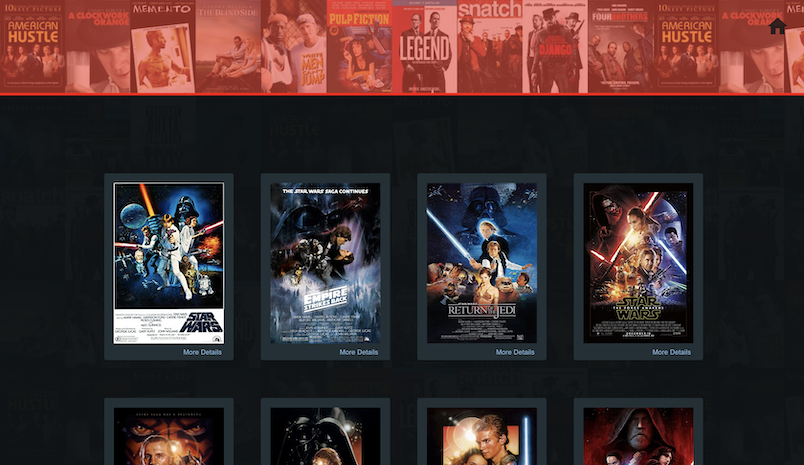

## Movie Ratings App
[github.com/ratta2ii/movie-ratings-app](https://github.com/ratta2ii/movie-ratings-app)
<!-- | Github Repository |
| ------ |
| [github.com/ratta2ii/movie-ratings-app](https://github.com/ratta2ii/movie-ratings-app) |  -->
#

## Project Description
# 
_Movie Ratings App is a client-side application that uses a Firebase database for client-side queries. The application is built using JavaScript with the React library, and Material UI for design._

 _The application also takes advantage of an API (omdbapi.com), allowing a user to search for movies according to different specifications. This particular application searches for movies by title name for the first request, and by ID at an additional endpoint for the second request. When the API first returns a list of movies, a user can then select a single movie, at which point the selected movies ID is targeted and used to make the second request to retrieve all of the details for that specific movie._ 
 
 _I also implemented both upvote and downvote functionality for each selected movie, which allows each user to add their own rating. A user can choose only one rating per session (since there is no authentication), however, a user can deselect their current vote and vote again. Votes are then stored in a database and saved in accordance with their ID. Each time a movie is selected, the database is queried in order to retrieve any previous upvotes and downvotes._

 _I also chose to use several additional technologies to build an application that would be both scalable and what I believe would be more in line with a larger application. For example, instead of drilling props to child components, since it is a relatively small application, I chose to use Redux for global state management as a way to demonstrate additional skills. For this same reason, I also chose to a couple different reducers along with a root reducer. I also used action creators, action types, constants, added middleware and a middleware logger, and structured the application in a way that would be easily scalable for additional functionality._

## Setup

1. Get API key from 
#

## Technologies Used
#
| Languages | Frameworks | Cloud | Styling | Other |
| ------ | ------ | ------ | ----- | ----- |
| `JavaScript` | `React (library)`| `Firebase` | `Material UI` | `Redux` |
| `HTML` |  |  |  |  |
| `CSS` |  |  | |  |
